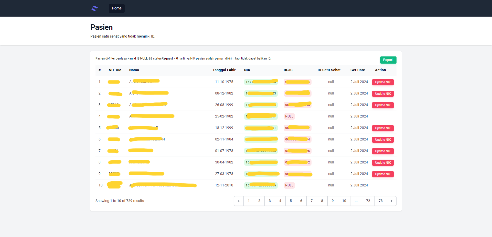
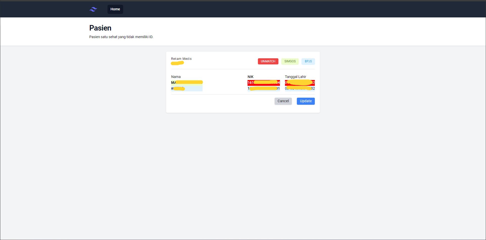
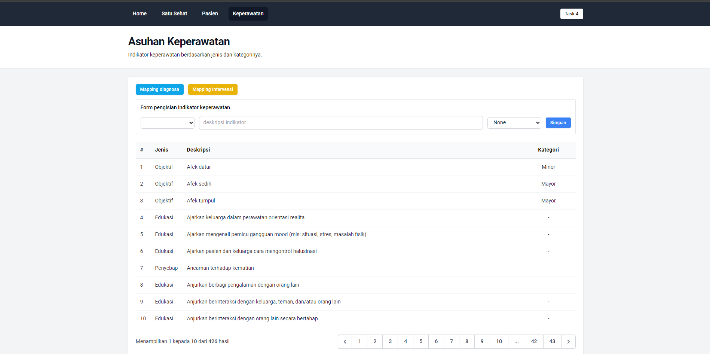

# NIK-NF (NIK Not Found)

Dibuat untuk menampilkan NIK yang pernah dikirim tapi belum mendapatkan `ID` Satu Sehat. Aplikasi ini dibuat menggunakan framework `php`: [Laravel 10](https://laravel.com/docs/10.x), dan akan dikembangkan sesuai kebutuhan pribadi.

## Requirement

-   Web server [Laragon](https://laragon.org/download/) atau [XAMPP](https://www.apachefriends.org/download.html), atau sejenisnya
-   PHP >= 8.1 (sudah include di webserver biasanya)
-   [Composer](https://getcomposer.org/download/)

## Installation

instalasi kita asumsikan menggunakan laragon dan sudah terinstal di windows.
copy folder aplikasi (jika download rar/zip) atau clone repository ke `root` folder laragon, biasanya di `C:\laragon\www`

```bash
C:
|-laragon
  |-www
    |- nik-nf
```

kemudian `stop all` webserver dan jalakan kembali.

copy `.env.example` dan rename menjadi `.env` atau jalankan perintah terminal berikut pada root folder aplikasi:

```bash
cp .env.example .env
```

buka file `.env` dan configurasi database dan vclaim:

```bash
DB_HOST=127.0.0.1       #ip database
DB_PORT=3306            #port database
DB_USERNAME=admin       #username
DB_PASSWORD=password    #password

# BPJS
CONS_ID=
SECRET_KEY=
USER_KEY_VCLAIM=
API_BPJS_VCLAIM=https://apijkn.bpjs-kesehatan.go.id/vclaim-rest/
```

kemudian hapus file `composer.lock` untuk menghindari error saat menjalankan perintah composer:

```bash
rm -f composer.lock
```

jalankan perintah `composer` untuk download dependencies:

```bash
composer install --optimize-autoloader --no-dev
```

dan jalankan perintah `artisan` untuk generate `key` baru.

```bash
php artisan key:generate
```

jalankan perintah `artisan` untuk `clear cache`. 
```bash
php artisan optimize:clear
```

---

Selesai. Buka aplikasi di web browser pada alamat [http://nik-nf.test](http://nik-nf.test).

### Screenshot

<div style="text-align:center">

</div>


<div style="text-align:center">

</div>

<div style="text-align:center">

</div>
